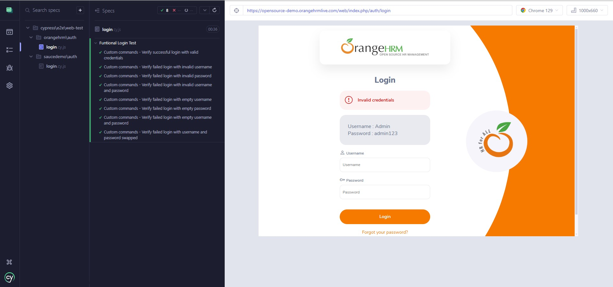
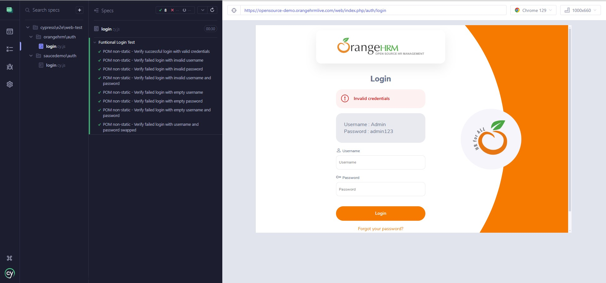

# Web Automation OrangeHrm using Cypress
Repository for Project Task Sanbercode Quality Assurance Engineer Bootcamp. This is a web testing automation project built using the **Cypress** framework. **Created by: Habib Akbar**

<p align="center">
    
</p>

## Overview
The project includes login test cases from [OrangeHrm](https://opensource-demo.orangehrmlive.com/web/index.php/auth/login). The goal of this project is to provide automated test cases for common user interactions on the OrangeHRM website, ensuring robust and reliable functionality. The login feature is implemented in three ways. First, using a custom command. Second, using Page Object Model (POM) with a non-static object. Lastly, using POM with a static object. All implementations run smoothly without any issues. This is a practice project, which is why I explored three different approaches.

## Screenshot of Login Test Execution

### Script Writing with Custom Command


### Script Writing with POM non-static object


### Script Writing with Pom static object


## Features
### Auth
1. **Login**
   - Verify successful login with valid credentials
   - Verify failed login with invalid username
   - Verify failed login with invalid password
   - Verify failed login with invalid username and password
   - Verify failed login with empty username
   - Verify failed login with empty password
   - Verify failed login with empty username and password
   - Verify failed login with username and password swapped

2. **Note**
   - This project will be updated for the others feature on the OrangeHRM stay tuned!

## Test Cases Documentation
All test cases have been created and documented in google spreadsheet. These test cases cover:
- Login test cases

You can view and download the test case here: [OrangeHrm - Test Cases](https://docs.google.com/spreadsheets/d/18m7ARsywtcBWinW_aWmjHukcXHz3DcB7e2I5WjHLimA/edit?gid=0#gid=0).

## Installation and Setup
To set up and run this project locally, follow these steps:

1. **Clone the repository:**
    ```bash
    git clone https://github.com/hbibakbr/cypress-automation-orangehrm.git
    ```

2. **Navigate to the project directory:**
    ```bash
    cd cypress-automation-orangehrm
    ```

3. **Install dependencies:**
    ```bash
    npm install cypress --save-dev
    ```

4. **Run the tests:**
    ```bash
    npx cypress open
    ```
    This will open the Cypress Test Runner, where you can run the test cases interactively.


## Acknowledgements
A huge thanks to the amazing Cypress community and the OrangeHRM for providing a great platform for testing.
Happy Testing! 🚀